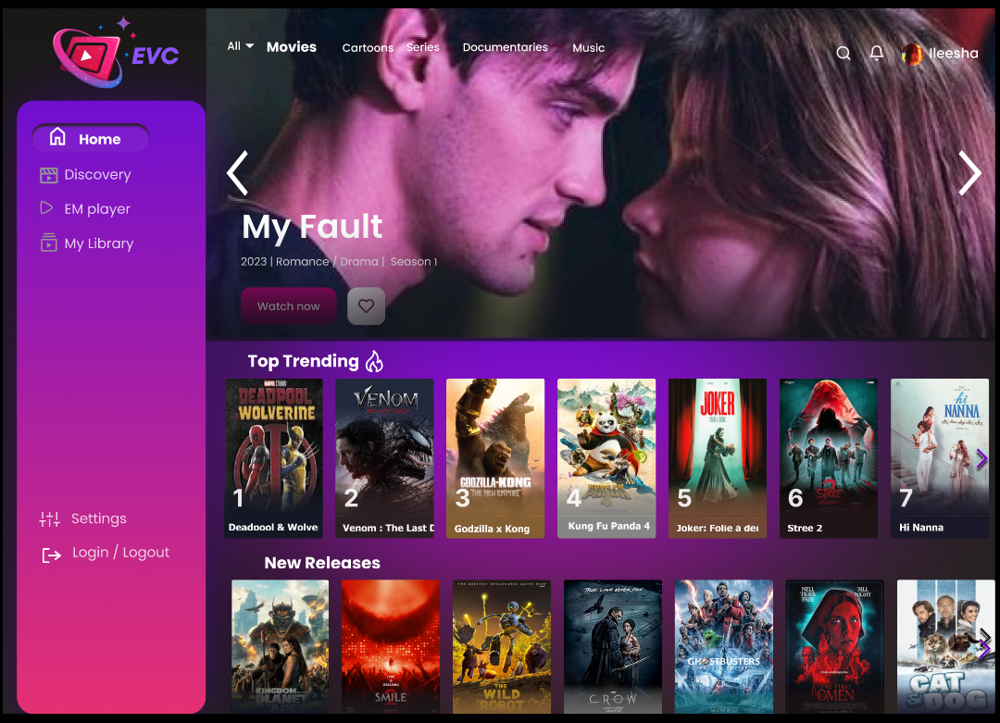

# 🎵 EVC - Entertainment Web UI

## Frontend Project

A modern entertainment streaming platform user interface designed to provide users with a smooth and visually engaging digital experience.

This project focuses on creating a responsive and attractive web interface with a dark futuristic theme, interactive navigation, content discovery sections, and user-focused layouts.



---

# 📌 Project Overview

EVC is a frontend web UI concept designed for an entertainment platform.

The interface provides users with an experience similar to modern streaming applications where users can:

- Browse entertainment content
- Discover recommended items
- Access personal libraries
- Manage settings
- View user dashboard information

The design focuses on:

- Clean user experience
- Modern UI components
- Easy navigation
- Visual content presentation

---

# 🎯 Objectives

The main objectives of this project are:

- Design an attractive entertainment platform interface
- Create an easy-to-use navigation system
- Build reusable UI components
- Improve user interaction experience
- Develop a modern responsive layout

---

# 🖥 User Interface Preview

## Home Screen

The home page acts as the main user dashboard where users can discover available content.

It contains:

- Navigation sidebar
- Featured content area
- Recommended sections
- Trending content cards
- User-focused dashboard layout


### Home Page Screenshot


---

# ✨ UI Features

## 🏠 Home Dashboard

The home screen provides:

- Featured entertainment banner
- Content recommendations
- Trending sections
- Quick access navigation
- Personalized user experience


---

## 🔍 Discovery Experience

The interface supports:

- Content exploration
- Category browsing
- Visual media cards
- Recommendation-based layout


---

## 📚 Library Section

Users can organize and access:

- Saved content
- Favourite items
- Recently viewed media


---

## ⚙ Settings Interface

The UI includes settings management areas for:

- User preferences
- Account options
- Application controls


---

# 🎨 Design Style

The UI follows a modern streaming-platform inspired design.

Design characteristics:

- Dark theme interface
- Neon visual style
- Gradient elements
- Card-based layouts
- Minimal and clean navigation

---

# 🏗 UI Structure

```
EVC-Web-UI/

│
├── Home Page
│
├── Navigation Sidebar
│
├── Featured Section
│
├── Content Cards
│
├── Discovery Area
│
├── Library Section
│
├── Settings Section

```

---

# 🛠 Technologies Used

## Frontend

- HTML
- CSS
- JavaScript

## UI Development

- Responsive layouts
- Component based design
- Modern styling techniques


## Development Tools

- Visual Studio Code

---

# 🔄 User Flow

```
Open Application

        ↓

Login / Signup

        ↓

Home Dashboard

        ↓

Browse Content

        ↓

Explore Categories

        ↓

Manage Library & Settings

```

---

# 📂 Project Structure

```
EVC-Web-UI/

│
├── index.html
│
├── css/
│   └── style.css
│
├── js/
│   └── script.js
│
├── assets/
│   ├── images/
│   └── icons/
│
├── screenshots/
│   └── home-page.png
│
└── README.md

```

---

# 🚀 Future Improvements

Possible future enhancements:

- User authentication system
- Real streaming API integration
- Backend connection
- Search functionality
- Recommendation engine
- Mobile responsive optimization
- User profile management

---

# 🔐 Project Privacy

This is a private frontend development project.

The design, source code, and UI implementation are maintained privately.

---

# 👨‍💻 Developed By

 Frontend UI Built ❤️ by <a href="https://github.com/IleeshaUdari"><strong>M.G.Ileesha Udari Sasmitha</strong></a>

Entertainment Platform Web Interface

```
